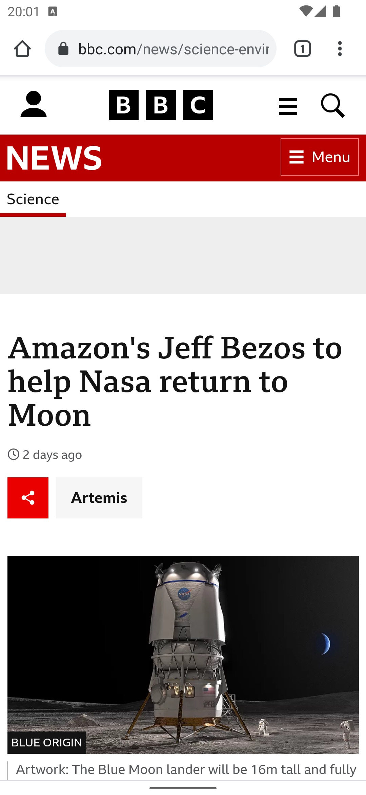
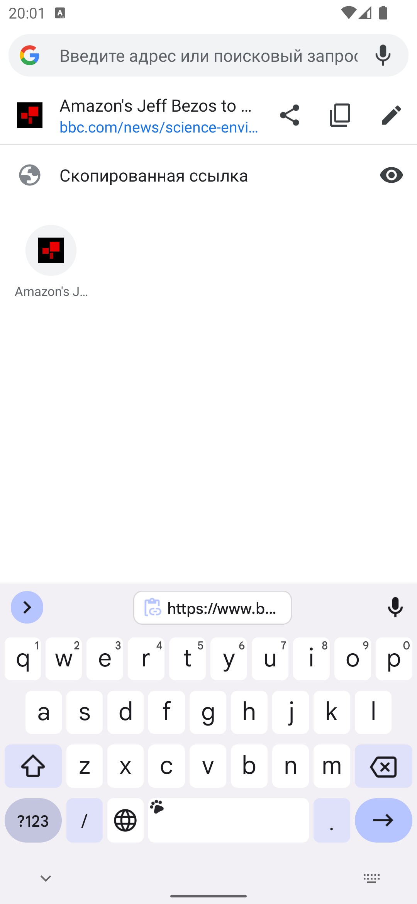
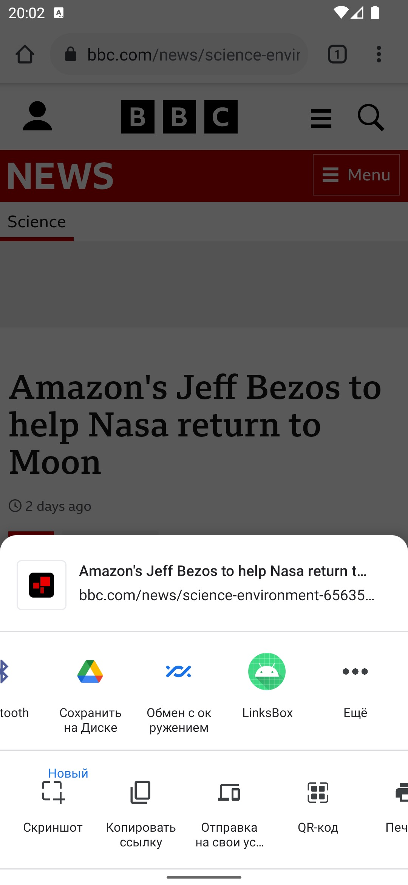
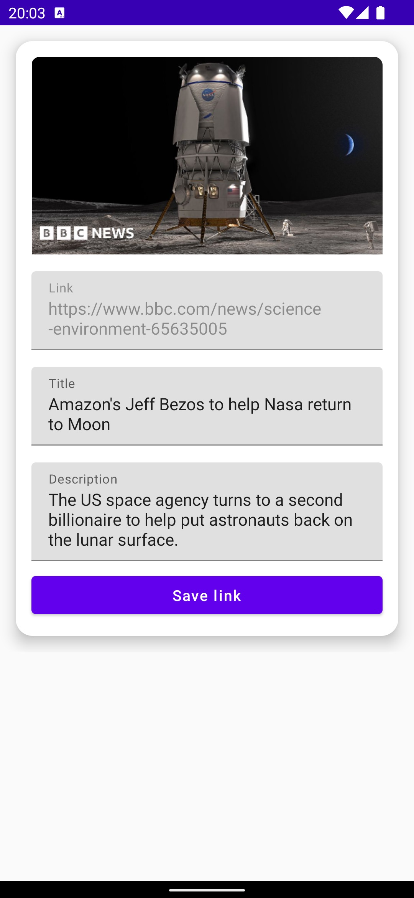

# LinksBox

LinksBox - a simple application with multiple screens. 
The application allows you to send links from the browser and save them in created folders. 
The application is built on an MVI-like architecture. 
The UX design of the application is not fully developed, it is a first draft version.

## Screenshots
   
